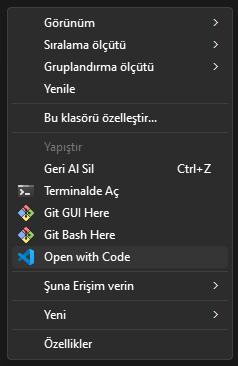
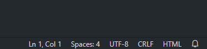

# LAB-00 (Hazırlık)

* Web Tabanlı Uygulama dersimiz için [Visual Studio Code](https://code.visualstudio.com/), [Notepad++](https://notepad-plus-plus.org/) gibi herhangi bir kod editörü kullanabilirsiniz.
* Kullandığınız kod editörünün kodlarınızı renklendirmesi kod yazma performansınızı olumlu yönde etkileyecektir.
* VSCode kullanarak bir klasörü komple editörde açabilir ve bu klasördeki tüm dosyaları ve klasörleri sol tarafta görebilirsiniz. Böylece editörü terk etmeden dosyaları açıp düzenleyebilirsiniz.

* Kullandığınız editörde dil, dosya kodlama biçimi ve yeni satır tercihlerinizi nasıl düzenleyebileceğinizi bilmeniz önemlidir. Örneğin VSCode'da bir dosya açtıktan sonra sağ alt köşede şuna benzer butonlar göreceksiniz:

* Dersimiz boyunca UTF-8 kodlama kullanıyor olacağız. Dosyalarınızın bu formatta olduğundan emin olunuz. Quizlerinizde gönderdiğiniz tüm dosyalar da bu formatta olmalıdır.
* CRLF yazan buton ile yeni satır biçimi değiştirilebilir.
  * Windowslarda yeni satır karakteri: \r\n
  * Linuxlarda ve MacOS X'ten itibaren yeni Maclerde yeni satır karakteri: \n
  * MacOS 9 ve öncesinde yeni satır karakteri: \r
  Bu karakterlerden \r olan CR (Carriage Return), \n olan LF (Line Feed) olarak isimlendirilir. Bu iki karakterin sırasıyla art arda kullanılması ise CRLF olarak ifade edilir.
  Not:
  > Windows işletim sistemleri de \n ile oluşturulan yeni satırları desteklediği için ve VSCode platformlar arası geçişlerde sorun çıkarmadığı için programatik olarak oluşturduğunuz dosyalarda daima \n kullanmanızda bir sakınca olmayacaktır.

# Ders ve quizler hakkında uyarılar

* Uygulama derslerimizde yaptığımız alıştırmalar quizlerinize hazırlanabilmeniz için önemlidir. Tamamlayamadığınız alıştırmalar için yardım isteyebilirsiniz.
* Teori dersimizin PDF'lerindeki tüm kodları mutlaka kendiniz de deneyin.
* Quizleriniz için belirlenen sürelerin dışında cevap gönderimi yapamazsınız. Belirtilen platform (E-kampüs) haricinde bir yoldan yapılan gönderimler dikkate alınmayacaktır.
* Quiz sırasında stabil olmayan internetiniz veya elektriğiniz sebebiyle geç gönderimlerinize tolerans uygulanmasını beklemeyiniz. Bu gibi durumları tespit edip doğrulama imkanımız olmadığından çok sayıda quiz yapılmaktadır. Tek bir cevabınızda aksilik yaşamanız başarınızı istatistiksel olarak ciddi ölçüde etkilemeyecektir. Sık problem yaşadığınız bir yerde ikamet ediyorsanız quizlerinizden önce durumunuzu bildiriniz.
* Tüm quiz cevaplarınız arasında intihal kontrolü (plagiarism-checking) yapılmaktadır. Sene sonu benzerlik oranı yüksek olan sınav cevapları intihal olarak değerlendirilmekte ve not girişi 0 olarak yapılmaktadır. E-kampüs'te yayımlanan notlarınız nihai notlarınız olmayabilir.
* İntihal kontrolüne geçen senelerde gönderilmiş cevaplar da dahil edilmektedir. Lütfen çözümlerinizi tamamen kendiniz yapınız.
* "Bir kod daha ne kadar farklı yazılabilir ki?" şeklinde sorularla gelmeyiniz. Olasılık ve İstatistik dersi almanız tavsiye edilir. İntihal kontrollerimizde state-of-the-art plagiarism-checking yöntemleri kullanılmaktadır.
* Ders boyunca ChatGPT, Gemini vb. yapay zeka araçlarından faydalanmak serbesttir. Fakat bu gibi kaynakları sınavlarınızda kullanmaya çalışmayınız. Bunları tespit etmenin çok kolay olduğunu, üstelik cevaplarınızın birbirine benzemesi sebebiyle de intihal ile işaretlenebileceğini unutmayınız.
* Değişken/fonksiyon ismi değiştirmek, kod veya metin bloklarının yerlerini takaslamak gibi code-refactoring yöntemleri ile intihal tespit yöntemlerini aşabileceğinizi düşünmeyiniz.
* Ders saatleri dışında sorularınız için bize ulaşabilirsiniz. Bunun için lütfen dersimizin Telegram grubunu veya e-posta yöntemini kullanınız.

