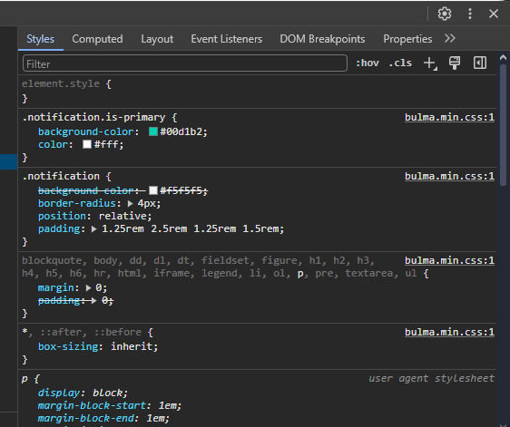

# LAB-03

- # CSS'e Giriş

- Aşağıdaki kod tüm \<p> etiketi ile belirlenmiş paragrafların rengini kırmızı (#FF0000) yapar.
```
<!doctype html>
<html>
<head>
    <title>CSS'e Giriş</title>
    <style>
        p {
            color: #FF0000;
        }
    </style>
</head>
<body>
    <p>CSS ile biçimlendirilmiş paragraf örneği.</p>
    <div>CSS kodu sadece p etiketi için belirtilmiş olduğundan burası varsayılan biçimde kalır.</div>
    <p>Bu paragraf da aynı biçime sahip.</p>
</body>
</html>
```

- Class belirleyerek sadece belirli bir grup paragrafın biçimlendirilmesini de sağlayabiliriz. CSS'te class'lar nokta (.) ile başlanarak belirtilir.
```
<!doctype html>
<html>
<head>
    <title>CSS'e Giriş</title>
    <style>
        p.bicimlendirilmis {
            color: #FF0000;
        }
    </style>
</head>
<body>
    <p class="bicimlendirilmis">CSS ile biçimlendirilmiş paragraf örneği.</p>
    <div>CSS kodu sadece p etiketi için belirtilmiş olduğundan burası varsayılan biçimde kalır.</div>
    <p>Bu paragraf biçimlendirilmez çünkü belirtilen class bu paragrafa eklenmemiş.</p>
</body>
</html>
```

- CSS'te bir stilin etkileyeceği grubu belirttiğimiz {...} ifadesinden önceki kısım "selector" olarak adlandırılır. Bir CSS class'ının tüm etiketler için geçerli olması için selector'daki etiket kaldırılabilir.
- Alt seviyede bulunan bir etiket, üst seviyeden biçimleri (kendisi için bu stiller özellikle belirtilmemişse) kalıtım alır. Bu p ve heading (h1, h2...) için geçerli değildir.
```
<!doctype html>
<html>
<head>
    <title>CSS'e Giriş</title>
    <style>
        .bicimlendirilmis {
            color: #FF0000;
        }
    </style>
</head>
<body>
    
    <p class="bicimlendirilmis">
        CSS ile biçimlendirilmiş paragraf örneği.
        <p>Burası paragraf içerisinde bulunan bir alt paragraf.</p>
    </p>
    
    <div class="bicimlendirilmis">
        CSS ile biçimlendirilmiş div örneği.
        <div>Burası div içerisinde bulunan bir alt div.</div>
    </div>

</body>
</html>
```

- HTML'de bir etiket için birden fazla class belirtilebilir.
```
<!doctype html>
<html>
<head>
    <title>CSS'e Giriş</title>
    <style>
        .stilA {
            color: #FF0000;
            font-family: 'Courier New', Courier, monospace;
        }

        .stilB {
            font-size: xx-large;
            text-align: center;
        }

    </style>
</head>
<body>

    <div class="stilA">
        stilA sınıflı div
    </div>

    <div class="stilB">
        stilB sınıflı div
    </div>

    <div class="stilA stilB">
        Hem stilA hem de stilB sınıflı div
    </div>

</body>
</html>
```


---


- # CSS Çeşitleri
- 3 çeşit CSS vardır:
  - Internal CSS (dahili)
  - Inline CSS (satır içi)
  - External CSS (harici)

- ## Internal CSS
- Bu dökümanda şu ana kadar gördüğümüz kodlar "internal CSS" türündendir. Bu türde, CSS kodları \<style>...\</style> etiketleri arasına yazılır.
- \<style> etiketleri body veya head içerisinde de olabilir fakat bunları head içerisine koymak, sayfa içeriği ile biçimlendirmesini ayırmak için daha mantıklıdır.
- Genel olarak syntax aşağıdaki gibidir. "type" niteliği belirtilmek zorunda değildir.
```
<style type="text/css"></style>
```

- ## Inline CSS
- Bu türde, CSS komutları (sadece {...} arası) etki etmesi istenen HTML etiketinin "style" niteliği içerisine yazılır.
```
<!doctype html>
<html>
<head>
    <title>CSS'e Giriş</title>
</head>
<body>

    <div style="color:#390b61; font-size: 50px;">
        Sınıf yok fakat stil var.
    </div>

    <div style="color:#27530a; font-weight: 800;">
        Sınıf yok fakat stil var. Hem rengi değiştirdik hem de yazı kalınlığını.
    </div>

</body>
</html>
```
- Inline CSS, diğer türdeki CSS komutlarını override edebilir.


- ## External CSS
- CSS kodları, harici bir *.css dosyasına yazılıp HTML sayfalarda kullanılabilir. Bunun için head etiketleri arasında aşağıdaki gibi css dosyasının konumu belirtilmelidir. (Link etiketindeki type niteliği opsiyoneldir.)

sayfam.html dosyasının içeriği
```
<!doctype html>
<html>
<head>
    <title>CSS'e Giriş</title>
    <link rel="stylesheet" href="stilim.css" type="text/css">
</head>
<body>

    <div class="stilA">
        stilA sınıflı div
    </div>

    <div class="stilB">
        stilB sınıflı div
    </div>

    <div class="stilA stilB">
        Hem stilA hem de stilB sınıflı div
    </div>

</body>
</html>
```

stilim.css dosyasının içeriği:
```
.stilA {
    color: #FF0000;
    font-family: 'Courier New', Courier, monospace;
}

.stilB {
    font-size: xx-large;
    text-align: center;
}
```


---


- # CSS Komutları
- Daha fazla CSS komutu için [Mozilla](https://developer.mozilla.org/en-US/docs/Web/CSS/Reference) sayfasından güncel bilgileri takip edebilirsiniz.
- Diğer kaynaklar: [CSSReference](https://cssreference.io/), [W3Schools](https://www.w3schools.com/cssref/index.php)


---


- # CSS Selectors
- İyi biçimlendirme yapmak için selector'ları kullanmayı bilmek önemlidir.
- Bu selector'lar çoğunlukla Javascript kodlarında, HTML sayfalarda belirli bir alanı seçebilmek ve üzerinde işlemler yapabilmek için de kullanılır.
- Selector'lar için kaynaklar:
    - [W3Schools](https://www.w3schools.com/cssref/css_selectors.php)
    - [Mozilla](https://developer.mozilla.org/en-US/docs/Web/CSS/CSS_selectors)
    - [Mozilla Learn](https://developer.mozilla.org/en-US/docs/Learn/CSS/Building_blocks/Selectors)


---


- # CSS'te Responsive Tasarım
- Telefon, tablet veya bilgisayar farketmeksizin her türlü ekran çözünürlüğüne uyumlu şekilde bir web uygulaması arayüzü geliştirmek için CSS'in @media kuralı kullanılabilir.
- Aşağıdaki örneği çalıştırırken tarayıcının genişliğini azaltıp artırmayı deneyiniz. @media kurallarına göre arkaplan renklerinin değiştiğine dikkat ediniz.
```
<!doctype html>
<html>
<head>
    <title>CSS'e Giriş</title>
    <style>
        @media only screen and (min-width: 500px) and (max-width: 1000px) {
            .stilA {
                background-color: #2fc;
            }

            .stilB {
                background-color: #cf2;
            }
        }

        @media only screen and (min-width: 1001px) {
            .stilA {
                background-color: rgb(188, 152, 220);
            }

            .stilB {
                background-color: rgb(147, 87, 137);
            }
        }
    </style>
</head>
<body>

    <div class="stilA">
        Satır 1
    </div>

    <div class="stilB">
        Satır 2
    </div>

</body>
</html>
```
- Bu kurallar sayesinde HTML ögelere, cihaza göre; yeniden boyutlandırma, germe, daraltma, yeni satıra kaydırma, yan yana koyma vb çeşitli özellikler kazandırılabilir.


---


- # CSS Kütüphaneleri
- [Bootstrap](https://getbootstrap.com/), [Bulma](https://bulma.io/), [W3.CSS](https://www.w3schools.com/w3css/w3css_intro.asp) vb kütüphaneler ile responsive tasarımlar yapmak daha kolaydır.
- Kullanılacak kütüphanenin CSS dosyasını harici CSS olarak HTML sayfada belirtmek gerekir. (Bootstrap ek JS dosyaları gerektirebilir. Bulma ve W3CSS yalın bir *.css dosyasından oluşmaktadır.)
- Bu kütüphanelerde class'lar hazır halde bulunmaktadır. HTML ögelere bu class'ları, dökümanlarda belirtildiği şekilde atamak tasarım için çoğu zaman yeterli olmaktadır.
- Bütün HTML sayfanın genişliği genellikle 12 eş parçaya ayrılır ve ögeler bu 12 birimlik uzunluğu dolduracak şekilde yerleştirilir.


---

- # Bulma CSS Kütüphanesi
- Kolay kullanımlı ve hafif bir CSS kütüphanesidir.
- Tasarıma başlamak için aşağıdaki HTML kodu kullanmak yeterlidir: ( [Kaynak](https://bulma.io/documentation/overview/start/) )
```
<!DOCTYPE html>
<html>
  <head>
    <meta charset="utf-8">
    <meta name="viewport" content="width=device-width, initial-scale=1">
    <title>Hello Bulma!</title>
    <link rel="stylesheet" href="https://cdn.jsdelivr.net/npm/bulma@0.9.4/css/bulma.min.css">
  </head>
  <body>
  <section class="section">
    <div class="container">
      <h1 class="title">
        Hello World
      </h1>
      <p class="subtitle">
        My first website with <strong>Bulma</strong>!
      </p>
    </div>
  </section>
  </body>
</html>
```

- Bulma'nın standart içerik yerleştirme alanı container class'ına sahip div etiketinin içidir. (Buna benzer durum Bootstrap vb. kütüphanelerde de vardır.)
- İçerik kısmına satırlarımızı "columns" sınıfıyla, satır içlerine sütun tanımlamalarımızı ise "column" sınıfıyla yaparız:
```
<!DOCTYPE html>
<html>

<head>
    <meta charset="utf-8">
    <meta name="viewport" content="width=device-width, initial-scale=1">
    <title>Hello Bulma!</title>
    <link rel="stylesheet" href="https://cdn.jsdelivr.net/npm/bulma@0.9.4/css/bulma.min.css">
</head>

<body>

    <section class="section">
        <div class="container is-fluid">

            <div class="columns">

                <div class="column is-6 is-info">
                    <p class="notification is-primary">6br kolon</p>
                </div>

                <div class="column">
                    <p class="notification is-warning">Otomatik genişlikte kolon</p>
                </div>

            </div>

            
            <div class="columns">

                <div class="column is-8 is-info">
                    <p class="notification is-primary">8br kolon</p>
                </div>

                <div class="column">
                    <p class="notification is-warning">Otomatik genişlikte kolon</p>
                </div>

                <div class="column">
                    <p class="notification is-warning">Otomatik genişlikte kolon</p>
                </div>

            </div>

        </div>
    </section>

</body>

</html>
```

> Yukarıdaki örnekte p etiketi ile kullanılan notification class'ı, div'in sınırlarını belli etmek amacıyla kullanılmıştır. p etiketi olmadan da HTML içerik yerleştirilebilir.

> info, warning, danger, link, success vb isimlerde CSS class'ları pek çok kütüphanede kolay renklendirme yapabilmek için bulunur.

> Yukarıdaki örnekte "container" div'i için "is-fluid" sınıfı da kullanılmıştır. Bu Bulma'da geniş ekran içerik taşıyıcısı manasına gelmektedir. [Daha fazlası için kaynak.](https://bulma.io/documentation/layout/container/)


---


- # Alıştırma #1
- Son HTML örneğini kendi dosyanızı oluşturarak deneyiniz.
- Sayfayı çalıştırdıktan sonra HTML ögelere sağ tıklayıp "Denetle" veya "Ögeyi İncele" seçenekleriyle bu ögeler için ayarlanmış CSS ayarlarını inceleyiniz.




---


- # Alıştırma #2
> Dikkat! Bu alıştırma yukarıda bahsi geçen kütüphanelerin dökümanlarını incelemeyi gerektirir. Alıştırma boyunca bu kaynaklardan faydalanmanız yasak olmamakla beraber kesinlikle tavsiye edilir. Yönlendirme için yardım istemekten çekinmeyiniz.
- Aşağıdaki görsele uygun tasarımı Bulma kütüphanesini kullanarak uygulayınız. Kütüphaneye ait CSS dosyasını indirip, HTML sayfanızın doğrudan bu dosyayı kullanmasını sağlayınız.


- Sayfa içeriğine "lorem5000" yerleştiriniz.
- Menü linklerinde href nitelikleri için "#" değerini kullanınız.
- Tarayıcı genişliği 1000px'in (yaklaşık değerdir, kullandığınız kütüphanenin dökümanını inceleyiniz ve 1000px üzerindeki en düşük breakpoint'i kullanınız) altına düştüğünde;
    - Sol menü, sayfa içeriğinin üstünde olmalı (column numaralarını ayarlayınız)
    - "Menü" başlığı kaybolmalı (ilave internal/inline css ile "display:none;" ve "display:block;" ifadelerini kullanınız)
    - Ana Sayfa butonu üst barın soluna, "Giriş Yap" ve "Kayıt Ol" butonları aynı hizada barın sağ tarafına yaslı olmalıdır.
    - Tablo kullanmayınız. (Ya da isterseniz kullanın ve responsive tasarım için neden uygun olmadığını görün. Ama gönderimleriniz içerisinde table etiketi bulunmamalıdır.)
    - [Yardımcı kaynak](https://bulma.io/documentation/columns/responsiveness/)
> Tüm projeniz 1 adet HTML ve 1 adet CSS dosyasından oluşmalı. Projenizi ziplemeyiniz. 2 dosyayı birlikte Ekampüs'e yüklemeyi unutmayınız.
