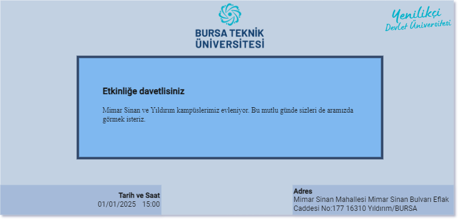

# CSS Komutları ve Örnekler

## Temel Komutlar

### Renk Belirtme

Renkler hexadecimal, RGB veya isimle belirtilebilir.

```css
/* Hexadecimal */
.color-hex {
    color: #FF0000;
}

/* RGB */
.color-rgb {
    color: rgb(255, 0, 0);
}

/* İsim */
.color-name {
    color: red;
}
```

### Padding ve Margin

Padding ve margin değerlerine tek, çift ve dörtlü değerler verilebilir:

```css
/* Tek Değer */
.element {
    padding: 10px;
    margin: 10px;
}

/* Çift Değer */
.element {
    padding: 10px 20px;
    margin: 10px 20px;
}

/* Dörtlü Değer */
.element {
    padding: 10px 20px 15px 25px;
    margin: 10px 20px 15px 25px;
}
```

### Gölgelendirme

```css
.shadow {
    box-shadow: 2px 2px 5px #888888;
}
```

### Kalıtım ve Important İfadesi

- Aşağıdaki tüm class'ları tek bir HTML ögesinde kullanınız. Çalıştırdıktan sonra kod satırlarının yerlerini değiştirip tekrar çalıştırmayı deneyiniz.

```css
/* Kalıtım */
.parent {
    color: blue;
}
.child {
    /* Parent'ın rengini kalıtım olarak alır */
}

/* Important İfadesi */
.element {
    color: red !important;
}
```

### Display

CSS'de `display` özelliği, bir HTML öğesinin nasıl gösterileceğini belirler. Temel olarak, bu özellik HTML öğelerinin blok düzeni, enine düzeni veya gizlenmiş olup olmayacağını kontrol eder. İşte `display` özelliği için kullanılabilecek seçeneklerin farkları:

1. **block**: Öğeyi bir blok olarak görüntüler. Blok öğeler, ekrandaki genişliklerinin tamamını kaplar ve her zaman yeni bir satırda başlar. (Örneğin, `div`, `p`, `header` gibi.)

2. **inline**: Öğeyi bir satır içinde görüntüler. Satır içi öğeler, içeriğin boyutuna göre genişler ve yan yana sıralanır. (Örneğin, `span`, `a`, `strong` gibi.)

3. **inline-block**: Öğeyi bir satır içinde görüntüler, ancak blok özelliklerini korur. Yani, içeriği satır içinde hizalanırken, öğe genişlik ve yükseklik özelliklerini alabilir. (Bu özellik, `inline` ve `block` özelliklerinin birleşimidir.)

4. **none**: Öğeyi görünmez hale getirir. Bu, bir öğenin sayfada hiçbir yer kaplamamasını sağlar ve görünmez hale getirir. Öğenin içeriği veya yer tutucu (placeholder) alanı dikkate alınmaz.

5. **flex**: Öğeyi bir flex konteyneri olarak görüntüler. Flex konteynerleri, içerdikleri öğeleri esnek bir düzende hizalar ve öğelerin boyutunu ve sıralamasını kontrol edebilirler.

6. **grid**: Öğeyi bir grid konteyneri olarak görüntüler. Grid konteynerleri, içerdikleri öğeleri bir ızgara (grid) içinde hizalar ve öğelerin konumunu ve boyutunu kontrol edebilirler.

6. **grid**: Öğeyi bir grid konteyneri olarak görüntüler. Grid konteynerleri, içerdikleri öğeleri bir ızgara (grid) içinde hizalar ve öğelerin konumunu ve boyutunu kontrol edebilirler.

7. **table**: Öğeyi bir tablo olarak görüntüler. `table` özelliği, içeriğin tablo olarak düzenlenmesini sağlar. Tablo öğeleri (`<table>`, `<tr>`, `<td>`, `<th>`) için kullanılır. Bu özellik, tablo düzenini kullanmak istediğinizde faydalıdır.

```css
        /* block öğe */
        .display-block {
            display: block;
        }

        /* inline öğe */
        .display-inline {
            display: inline;
        }

        /* inline-block öğe */
        .display-inline-block {
            display: inline-block;
        }

        /* gizlenmiş öğe */
        .display-none {
            display: none;
        }

        /* flex konteyneri */
        .display-flex {
            display: flex;
        }

        /* grid konteyneri */
        .display-grid {
            display: grid;
        }

        /* table konteyneri */
        .display-table {
            display: table;
        }
```

> Bu CSS örneği, `display` özelliğinin farklı seçeneklerini kullanan farklı HTML öğeleri için hazırlanmış class'ları içerir.


# Örnek #1
- [duzenler.html](duzenler.html) dosyasını bilgisayarınıza indiriniz. Örneği çalıştırıp her bir `container` class'lı div'in çıktısını inceleyiniz.

# Örnek #2
- [hizalama.html](hizalama.html) dosyasını bilgisayarınıza indiriniz. Hizalama örneklerini inceleyiniz.

# Alıştırma #1
- Aşağıdaki görsele uygun bir davetiye sayfası oluşturunuz.



- Tüm tasarımı sadece `flex` düzeni ile tek bir HTML dosyası içerisinde oluşturunuz. Tablo kullanmayınız.
- Davetiye sayfasınızın içeriği tüm sayfayı kaplamalıdır.
- Ortadaki metin alanı tüm ekranın ortasında bulunmalıdır. Metin alanı için margin/padding ayarlarına ve dış çerçeve çizgisine dikkat ediniz.
- Logolar "orta-üst"te ve "sağ-üst"te bulunmalıdır.
- Logolar için [BTU Kurumsal Kimlik](https://btu.edu.tr/tr/sayfa/detay/3401/kurumsal-kimlik) sayfasından faydalanabilirsiniz.
- Sol-alttaki ve sağ alttaki metinlerin hizalamalarına dikkat ediniz.
- Renklerin yaklaşık değerlerde olması, farklı fontta gözüken alanlarda farklı fontlar belirtilmiş olması yeterlidir. Font ve renklerin birebir aynı olması beklenmemektedir.

> HTML dosyanızı Ekampüs'ten yüklemeyi unutmayınız.
