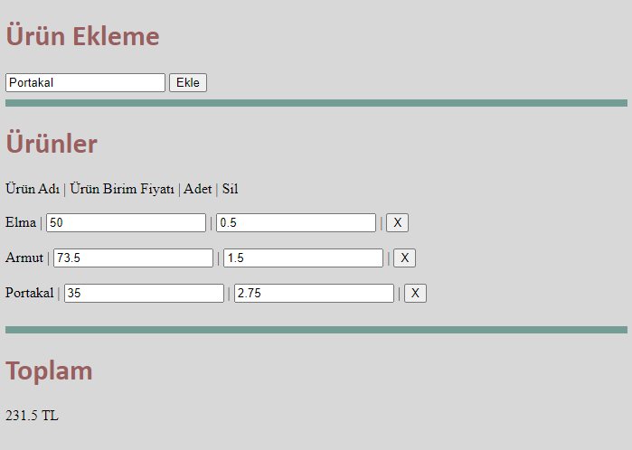

# LAB-05

# Javascript

---

# Alıştırma #1
- Alışveriş listesi tutmaya ve hesaplamaya yardımcı olan basit Single Page App hazırlayınız.
- Tüm alıştırmayı tek bir HTML dosyası içerisinde hazırlayınız.
- Aşağıdakine benzer şekilde 3 bölmeli anlaşılır bir arayüz tasarlayınız.

- İlk bölmede ürün adını isteyiniz. Kullanıcı bir ürün ismi girip `Ekle` butonuna tıkladığında `Ürünler` bölmesine basit bir arayüz olarak bu ürün eklenmelidir.
- Her ürünün kendine özgü bir birim fiyatı ve bir adet/birim miktarı olmalıdır. Ayrıca `X` butonu, kendi satırındaki ürünü listeden kaldırmalıdır.
- Her sayısal veri düzenleme ve ürün silme işlemlerinden sonra `Toplam` bölmesinde, hesaplanan toplam tutar `... TL` şeklinde yazılmalıdır.
- Her ürün ekleme sonrası, önceden eklenen ürünler için girilen miktar ve fiyat değerleri **kaybolmamalıdır**.

> Uygulamanızın arayüzü yukarıdaki görseldekinden farklı olabilir. Fakat tamamen tasarımsız bir uygulama yazmayınız. Basit birkaç CSS kodu ile arayüzünüzü anlaşılır tutmaya çalışınız.

> Tek HTML dosyadan oluşan uygulamanızı Ekampüs'ten gün içerisinde yüklemeyi unutmayınız.

