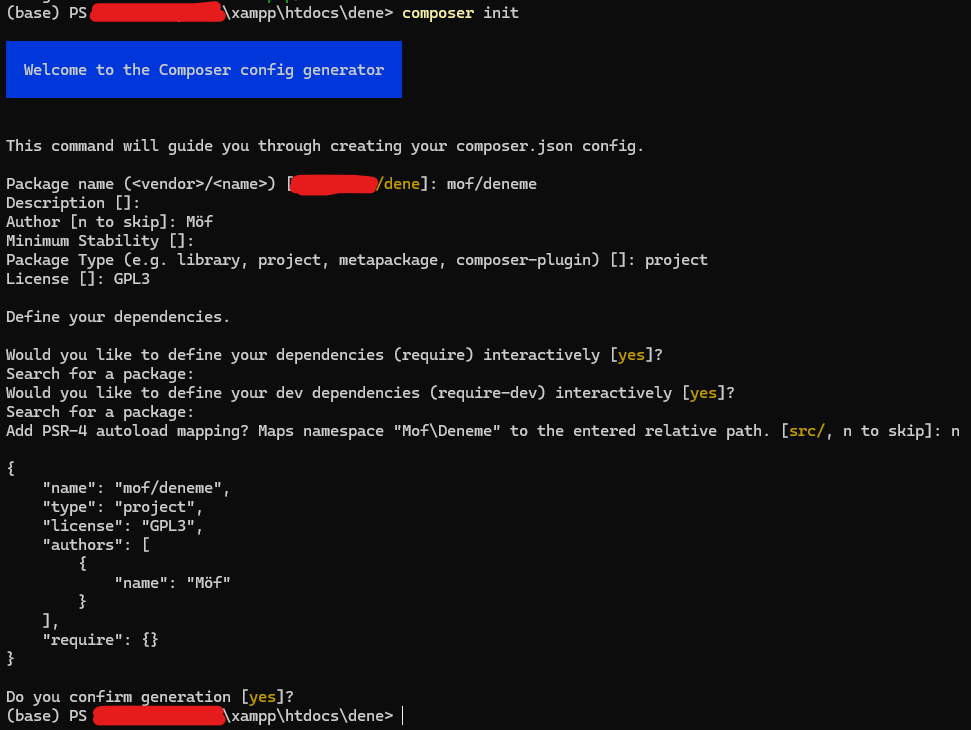
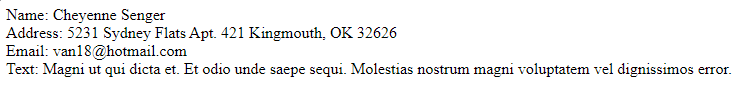

# LAB-12

## Composer Kurulumu

- Composer, PHP için bir bağlılık yöneticisidir. Python'da `pip` veya `anaconda`, JavaScript'te `npm`, Java'da `Maven`, PHP'de ise `Composer` sıklıkla kullanılan bağlılık/paket yönetim araçlarıdır. Bu gibi araçlar kullandığımız kütüphanelerin birbirleriyle uyumlu versiyonlarını bulma, yükleme ve kullanma aşamalarını otomatikleştirir. Gerçek hayattaki projelerde çok sayıda kütüphane kullanıldığından bunların uyumluluklarını projeye her yeni kütüphane ekleme aşamasında tekrar el ile kontrol etmek imkansız hale gelir. Bu işi bağlılık yöneticileri bizim için çözer.

- [getcomposer.org/download](https://getcomposer.org/download/) adresinden Composer yazılımını indirip kurunuz.

- Xampp kurulum dizinindeki `htdocs` alt dizinine geliniz. `deneme` isminde yeni bir klasör oluşturunuz. Bu klasördeyken `cmd` veya `powershell` programını çalıştırınız. (Veya bu programlardan birini çalıştırıp `cd /.../dizinyolu/` gibi bir komut ile bu dizine de gidebilirsiniz.) Bu etkinlik dökümanı `powershell` ile devam edecektir fakat `composer` yazılımının işleyişi her iki programda da aynıdır.

- Komut satırının başında `.../xampp/htdocs/dene` gibi bir ifade varsa doğru dizindesiniz demektir.

- Aşağıdaki komut ile `composer`'a bu klasörde çalışmak istediğimizi belirtelim:
```shell
composer init
```

- Paket isminizi `<geliştirici adınız>/<paket adınız>` şeklinde oluşturabilirsiniz. Bu etkinlikte `mof/deneme` ismi kullanılarak devam edilecektir.

- İstenen diğer tüm bilgileri boş bırakarak (varsayılan ayarları kabul ederek) geçebilirsiniz. (Bu etkinlikte paket türü olarak `project` seçilmiştir.)



- Aşağıdaki komut ile `faker` isimli paketi proje dizinimize yükleyelim:
```shell
composer require fakerphp/faker
```

- Projemizde `vendor` isminde 1 klasör, `composer.json` ve `composer.lock` isimlerinde de 2 dosya görüyor olmalıyız.

- `index.php` isminde bir dosya oluşturup aşağıdaki kodu içerisine yapıştırınız:
```php
<?php

require 'vendor/autoload.php';

$faker = \Faker\Factory::create();

echo "Name: " . $faker->name . "<br>\n";

echo "Address: " . $faker->address . "<br>\n";

echo "Email: " . $faker->email . "<br>\n";

echo "Text: " . $faker->text . "<br>\n";

```

- `http://localhost/deneme` adresine gidip sayfayı her yenilediğinizde rastgele bir sahte profil bilgileri ile karşılaşıyorsanız `composer` kurulumu ve kullanımı başarılı demektir.




---


## Alıştırma Hazırlığı

### Dikkat
- Bu alıştırmada sohbet geçmişi paylaşımı yapılabilen bir büyük dil modeli (LLM) yapay zeka sohbet hizmeti kullanmalısınız. ([OpenAI ChatGPT](https://chatgpt.com) ve [Google Gemini](https://gemini.google.com/) bunu destekler.)

- Gönderim yaparken hizmetin içerisindeki sohbet sayfasında, **herkese açık** şekilde paylaşılabilen bir URL oluşturmalısınız. Sohbet sonunda tarayıcı adres çubuğundaki URL'in gönderilmesi işe yaramayacaktır. Çalışmayan gönderimler değerlendirme dışı kalır.

- Tüm projenizin çalışır halini (tüm dosyalarınızı ve gerekiyorsa veritabanı şemanızı içeren *.sql dosyanızı da) bir `Github` reposuna yükleyiniz. Gönderiminizi yaparken bu repo adresini de belirtmelisiniz.
    - Github kullanıcı profili adresinizi veya branch linki göndermeyiniz.
    - Uygun repo linkleri:
        - `https://github.com/<kullanıcı adınız>/<proje adınız>.git`
        - `https://github.com/<kullanıcı adınız>/<proje adınız>`
        
        Bunların dışındaki bir formatta yapılan gönderimler değerlendirme dışı kalır.


<details>
<summary>MVC Projesi</summary>

### MVC Projesi
- [`Laravel`](https://laravel.com/docs/11.x) isimli MVC frameworkünü `Composer` ile kurunuz.
    - Bu projede bir MVC frameworkü kullanmalısınız. Eğer aşina olduğunuz veya daha kolay adapte olabileceğinizi düşündüğünüz PHP dilinde başka bir MVC frameworkü var ise (Örn; [Slim](https://www.slimframework.com/)) onu da kullanabilirsiniz.

- MVC bir mimari desendir. Bir projenin 3 parçaya ayrılarak daha kolay geliştirilmesi sağlanır:
    - Model: projenin veritabanı yapısını ve veritabanı ile etkileşimi için gereken sınıfları/kütüphaneleri/kodları içeren kısım
    - View: projenin ön yüzü için gerekli alt yapıyı bulunduran kısım
    - Controller: kullanıcıdan gelen direktifler doğrultusunda `Model` ve `View` nesnelerinden uygun olanlarını seçip kullanan kısım
        > Web MVC frameworklerinde bir `Controller` genellikle, kendisi için belirlenmiş bir `route` (bir websitenin bağıl adresi) ayarına göre hangi veritabanı tablosu (`Model`) ile etkileşime geçeceğini ve sonuçları hangi şablon (`View`) ile çıktılayacağını belirler.

</details>

## Alıştırma #1
- MVC mimarisinde bir `URL kısaltma` uygulaması geliştiriniz.

- Kullanıcılar uygulamanız aracılığıyla `https://website adresi/.../.../sayfa.html` gibi uzun bir URL'i, `http://website/B8dQw4_W9gXa` formatında kısa bir URL'e dönüştürebilmelidir. Yerelde çalışırken adresleriniz `http://localhost/B8dQw4_W9gXa` şeklinde olacaktır.

### Detaylar
- Ana sayfanızın tam ortasına kullanıcının URL yapıştırabileceği bir metin girdisi alanı (text input) ve bir buton yerleştiriniz.
- Kullanıcının verdiği URL'in uygun olup olmadığını bir regex (Regular Expressions) deseni kullanarak kontrol ediniz. Uygun olmayan URL'ler için kullanıcıya hata mesajı gösteriniz.
- Uygun bulunan URL'in daha önceden veritabanında olup olmadığını kontrol ediniz. Varsa; daha önceki kısaltmayı kullanıcıya gösteriniz. Yoksa; yeni bir kısaltma kaydı ekleyiniz ve kullanıcıya gösteriniz.
- Kısaltma kaydı oluştururken, kısa kimlik bilgisi için `kriptografik olarak güvenli` karakter oluşturma yöntemleri kullanınız. *(İpucu: [random_bytes()](https://www.php.net/manual/en/function.random-bytes.php) veya hazır bir kütüphane kullanabilirsiniz)*
- Kısa kimlik bilgisi en az 12 karakter olmalıdır ve aşağıdaki karakter kümelerini içerebilmelidir:
    - Büyük harfler (A-Z)
    - Küçük harfler (a-z)
    - Rakamlar (0-9)
    - Tire (-)
    - Alt tire (_)

> Bu projede kullanıcı kaydı, yönetim paneli vb özellikler beklenmemektedir. Tek bir tablo/model, tek bir şablon/view ve tek bir kontrolcü/controller gerekmektedir. İhtiyaç halinde daha fazlasını oluşturup kullanmakta serbestsiniz.
